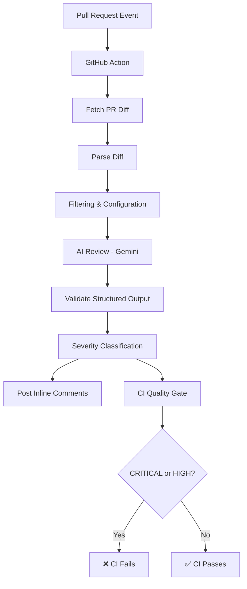

# 🤖 GitHub PR Review Bot

[](https://github.com/features/actions)
[](https://nodejs.org)
[](https://ai.google.dev)
[]()

An AI-powered GitHub Action that automatically reviews Pull Requests, identifies meaningful code issues, assigns severity levels, and posts inline review comments directly on GitHub.

---

## ✨ Features

- 🤖 **AI-powered** Pull Request code review
- 💬 **Inline** GitHub review comments on target code lines
- 🎯 **4-Level severity classification**:
  - `CRITICAL`: Security vulnerabilities, system compromise
  - `HIGH`: Serious bugs, reliability issues
  - `MEDIUM`: Meaningful non-critical issues
  - `LOW`: Minor issues with limited impact
- 🚦 **CI quality gate**: Fails automatically on `CRITICAL` or `HIGH` issues
- 🔍 **Configurable file filtering**: Filter by extensions, directories, and specific files
- 📦 **GitHub Action packaging**: Seamless repository integration
- 🛡️ **Prompt-injection aware**: Isolated PR diff content handling
- 🔁 **Idempotent execution**: Avoids duplicate reviews on updated PR commits
- 🧪 **Comprehensive test coverage**: 60+ unit and integration tests
- 📏 **Limit guards**: Set max files/diff size to prevent excessive review runs
- ⚙️ **Customizable**: Configurable via `reviewbot.config.js`

---

## 🏗️ Architecture



---

## ⚙️ How It Works

1. Opening or updating a Pull Request triggers the GitHub Action.
2. The action fetches PR metadata and altered file diffs.
3. Diff content is parsed and filtered based on configured extensions, directories, and ignore rules.
4. Filtered changes are processed through the Gemini LLM with structured review prompts.
5. Structured JSON responses containing findings and severity levels are validated against the actual diff line bounds.
6. Validated issues are posted as inline GitHub PR review comments.
7. Any `CRITICAL` or `HIGH` finding triggers a failed CI check.

---

## 📝 Example Review

**HIGH — Missing Input Validation**

```text
src/api/user.js:42

User-controlled input is passed directly into the database query
without validation. Unexpected input may cause incorrect queries or
application errors.

Suggested Fix: Validate and sanitize the input before querying.

```

### Severity → CI Behavior

| Severity | CI Result |
| --- | --- |
| `CRITICAL` | ❌ **FAIL** |
| `HIGH` | ❌ **FAIL** |
| `MEDIUM` | ✅ **PASS** |
| `LOW` | ✅ **PASS** |

---

## 🚀 Installation & Usage

### Step 1: Add the Action Workflow

Create `.github/workflows/pr-review.yml`:

```yaml
name: PR Review Bot

on:
  pull_request:
    types: [opened, synchronize, reopened]

permissions:
  contents: read
  pull-requests: write

jobs:
  review:
    runs-on: ubuntu-latest
    steps:
      - name: Checkout Code
        uses: actions/checkout@v4
        with:
          fetch-depth: 0

      - name: Run PR Review Bot
        uses: varunn15/github-pr-review-bot@v1
        with:
          GITHUB_TOKEN: ${{ secrets.GITHUB_TOKEN }}
          GEMINI_API_KEY: ${{ secrets.GEMINI_API_KEY }}

```

### Step 2: Add Required Secrets

Navigate to **Repository Settings** > **Secrets and variables** > **Actions** and add:

| Secret | Description |
| --- | --- |
| `GEMINI_API_KEY` | Google Gemini API key (obtainable via [Google AI Studio](https://ai.google.dev/)) |
| `GITHUB_TOKEN` | System-provided GitHub token (configured via workflow permissions) |

---

## ⚙️ Configuration

Create `reviewbot.config.js` in your root directory:

```javascript
module.exports = {
  filtering: {
    // File extensions to review
    allowedExtensions: [".js", ".jsx", ".ts", ".tsx"],

    // Directories to ignore
    ignoredDirectories: [
      "node_modules/",
      ".github/",
      "dist/",
      "build/",
      "coverage/",
    ],

    // Specific files to ignore
    ignoredFiles: [
      "package-lock.json",
      "yarn.lock",
      "pnpm-lock.yaml",
    ],

    // Maximum files to review per PR
    maxFiles: 50,

    // Maximum changed lines per PR
    maxChangedLines: 10000,
  },

  ci: {
    // Severities that cause CI to fail
    failOn: ["CRITICAL", "HIGH"],
  },
};

```

---

## 🧪 Testing

Run the local test suite:

```bash
npm test

```

**Test Output Overview:**

```text
✅ 6 test suites passing
✅ 60+ tests passing
⏭️ 7 prompt tests (skipped by default to optimize API quota usage)

```

---

## 📁 Project Structure

```text
github-pr-review-bot/
├── .github/
│   └── workflows/
│       └── pr-review.yml          # GitHub Actions workflow definition
├── src/
│   ├── index.js                   # Main orchestrator script
│   ├── filterFiles.js             # File inclusion/exclusion logic
│   ├── validateReview.js          # Review line-bounding validation
│   ├── ciGate.js                  # CI pass/fail logic
│   ├── github/
│   │   ├── fetchDiff.js           # PR diff fetcher
│   │   ├── postReview.js          # Comment publisher
│   │   └── reviewStatus.js        # Idempotency checker
│   └── review/
│       ├── parseDiff.js           # Git patch parser
│       ├── llmReview.js           # AI prompt orchestration
│       ├── schema.js              # Output JSON schema validator
│       └── providers/
│           └── gemini.js          # Gemini API connector
├── tests/
│   ├── ciGate.test.js             # CI gate tests
│   ├── filterFiles.test.js        # Filtering unit tests
│   ├── idempotency.test.js        # Duplicate prevention tests
│   ├── parseDiff.test.js          # Diff parsing tests
│   ├── prompt.test.js             # Prompt evaluation suite
│   ├── schema.test.js             # Schema enforcement tests
│   └── validateReview.test.js     # Review payload tests
├── dist/                          # Compiled production bundles
│   ├── index.js
│   └── licenses.txt
├── reviewbot.config.js            # Configuration file
├── action.yml                     # Action manifest
├── package.json
└── README.md

```

---

## 🔐 Design Considerations

* **Untrusted Input Isolation**: PR content is treated as untrusted data and strictly segregated from system prompts to prevent prompt injection attacks.
* **Deterministic CI Gate**: LLMs output findings, but binary CI pass/fail decisions are controlled deterministically by software logic.
* **Idempotency Guard**: Re-runs evaluate commit SHAs to skip previously reviewed content, avoiding duplicate comments and reducing token usage.
* **Targeted Diff Filtering**: Noise is reduced by filtering out compiled builds, lock files, and auto-generated code.

---

## ⚠️ Limitations

* AI recommendations may occasionally produce false positives or false negatives.
* Analysis is scoped to file diffs, not total system runtime context.
* Exceptionally large PRs exceeding defined limit thresholds are skipped.
* Review capability is subject to Gemini API availability and quota constraints.

---

## 🚀 Future Roadmap

* Support for additional providers (Anthropic Claude, OpenAI).
* Project-level rule enforcement options.
* Cross-file contextual dependency analysis.
* Multi-language custom static analysis integration.

---

## 📄 License

[MIT](https://www.google.com/search?q=LICENSE)

---

## 🤝 Contributing

1. Fork the project repository.
2. Create your feature branch (`git checkout -b feature/AmazingFeature`).
3. Commit your changes (`git commit -m 'Add AmazingFeature'`).
4. Run tests (`npm test`).
5. Open a Pull Request.

---

Made with ❤️ by [varunn15](https://github.com/varunn15)

